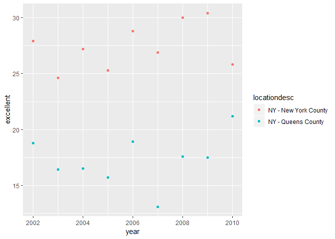

p8105\_hw2\_as5457
================
Sunny Siddique
October 1, 2018

------------------------------------------------------------------------

Problem 1
=========

**Read and clean the data; retain line, station, name, station latitude / longitude, routes served, entry, vending, entrance type, and ADA compliance. Convert the entry variable from character (YES vs NO) to a logical variable (the ifelse or recode function may be useful).**

``` r
#Loading the tidyverse package
library(tidyverse)
```

    ## -- Attaching packages ------------------------------------------------------------------------------ tidyverse 1.2.1 --

    ## v ggplot2 3.0.0     v purrr   0.2.5
    ## v tibble  1.4.2     v dplyr   0.7.6
    ## v tidyr   0.8.1     v stringr 1.3.1
    ## v readr   1.1.1     v forcats 0.3.0

    ## -- Conflicts --------------------------------------------------------------------------------- tidyverse_conflicts() --
    ## x dplyr::filter() masks stats::filter()
    ## x dplyr::lag()    masks stats::lag()

``` r
#Reading in the CSV File
transit_data = read_csv(file = "./data/NYC_Transit_Subway_Entrance_And_Exit_Data.csv") %>% 

#Cleaning variable
  janitor::clean_names(dat = .) %>%     
  
#renaming route variables with _ to be able to split by "_"
  rename (route_1 = route1, route_2 = route2, route_3 = route3, route_4 = route4, route_5 = route5, route_6 = route6, route_7 = route7, route_8 = route8, route_9 = route9, route_10 = route10, route_11 = route11) %>% 
  gather(key = route, value = route_name, route_1:route_11) %>%
  
#Splitting the route variable
  separate (route, into = c("route_str", "route_number"), sep = "_") %>%
  
#Selecting relevant variables
    select (line, station_name, station_latitude, station_longitude, route_number, route_name, entry, vending, ada) %>%   
  
#Converting the entry variable from character to logical.
  mutate(entry=ifelse(entry == "YES", yes = TRUE, no = FALSE))  
```

    ## Parsed with column specification:
    ## cols(
    ##   .default = col_character(),
    ##   `Station Latitude` = col_double(),
    ##   `Station Longitude` = col_double(),
    ##   Route8 = col_integer(),
    ##   Route9 = col_integer(),
    ##   Route10 = col_integer(),
    ##   Route11 = col_integer(),
    ##   ADA = col_logical(),
    ##   `Free Crossover` = col_logical(),
    ##   `Entrance Latitude` = col_double(),
    ##   `Entrance Longitude` = col_double()
    ## )

    ## See spec(...) for full column specifications.

**Write a short paragraph about this dataset and explain briefly what variables the dataset contains, describe your data cleaning steps so far, and give the dimension (rows x columns) of the resulting dataset. Are these data tidy?**

The variables in this dataset provide information regarding the line, name, exact location (latitude/longitude), the name and number of routes available at the station, entry, vending and ADA compliance status. To clean this dataset, I first used the janitor package to change the variable names to lower case and separated by "\_". Then I renamed the route variables and separated the character variables by underscores to be able to later split it into two variables: route number and route name. I then selected only the variables specified in the prompt and used the mutate and ifthen function to change the character variable "entry" into a logical variable. The dimension of the resulting dataset is \[20,548 x 9\]. These data are tidy in the sense that they meet the following three criteria: columns are variables, rows are observations, every value has a cell (even though not all cells have a value).

**How many distinct stations are there? Note that stations are identified both by name and by line (e.g. 125th St A/B/C/D; 125st 1; 125st 4/5); the distinct function may be useful here.**

The number of distinct stations is 465.

How many stations are ADA compliant?
------------------------------------

``` r
station_ADA = transit_data %>% 
  filter (ada == "TRUE") %>% 
  distinct (station_name)
nrow(station_ADA)
```

    ## [1] 73

What proportion of station entrances / exits without vending allow entrance?
----------------------------------------------------------------------------

``` r
vending =
transit_data %>% 
  filter (vending == "NO" & entry == "TRUE") %>% 
  distinct (station_name)
nrow(vending)/nrow(distinct(transit_data, station_name, line))
```

    ## [1] 0.09032258

Reformat data so that route number and route name are distinct variables. How many distinct stations serve the A train?
-----------------------------------------------------------------------------------------------------------------------

``` r
a_train = transit_data %>% 
  filter (route_name == "A") %>% 
  distinct(station_name)
nrow(a_train)
```

    ## [1] 56

Of the stations that serve the A train, how many are ADA compliant?
-------------------------------------------------------------------

``` r
ada_comp = transit_data %>% 
  filter (route_name == "A", ada == "TRUE") %>% 
  distinct(station_name)
nrow(ada_comp)
```

    ## [1] 16

Problem 2
=========

Read and clean the Mr. Trash Wheel sheet:

-   specify the sheet in the Excel file and to omit columns containing notes (using the range argument and \#\#cell\_cols() function)
-   use reasonable variable names
-   omit rows that do not include dumpster-specific data, rounds the number of sports balls to the nearest integer and converts the result to an integer variable (using as.integer)

``` r
library(readxl)
trash_wheel = readxl::read_excel("./data/HealthyHarborWaterWheelTotals2018-7-28.xlsx", sheet = 1, range = "A2:N258") %>% 
  janitor::clean_names(dat = .) %>% 
  filter(!is.na(dumpster)) %>% 
  mutate (sports_balls = as.integer(round(sports_balls, digits = 0)))
trash_wheel
```

    ## # A tibble: 216 x 14
    ##    dumpster month  year date                weight_tons volume_cubic_ya~
    ##       <dbl> <chr> <dbl> <dttm>                    <dbl>            <dbl>
    ##  1        1 May    2014 2014-05-16 00:00:00        4.31               18
    ##  2        2 May    2014 2014-05-16 00:00:00        2.74               13
    ##  3        3 May    2014 2014-05-16 00:00:00        3.45               15
    ##  4        4 May    2014 2014-05-17 00:00:00        3.1                15
    ##  5        5 May    2014 2014-05-17 00:00:00        4.06               18
    ##  6        6 May    2014 2014-05-20 00:00:00        2.71               13
    ##  7        7 May    2014 2014-05-21 00:00:00        1.91                8
    ##  8        8 May    2014 2014-05-28 00:00:00        3.7                16
    ##  9        9 June   2014 2014-06-05 00:00:00        2.52               14
    ## 10       10 June   2014 2014-06-11 00:00:00        3.76               18
    ## # ... with 206 more rows, and 8 more variables: plastic_bottles <dbl>,
    ## #   polystyrene <dbl>, cigarette_butts <dbl>, glass_bottles <dbl>,
    ## #   grocery_bags <dbl>, chip_bags <dbl>, sports_balls <int>,
    ## #   homes_powered <dbl>

``` r
as.integer(trash_wheel$sports_balls)
```

    ##   [1]  7  5  6  6  7  5  3  6  6  7  6  8  6  6  6  6  5  6  6  7  6  6  6
    ##  [24]  5  6  7  8  7  4  7  3  6  6  6  7  6  6  6  7  6  6  7  6  6  7  6
    ##  [47]  5  3  8 16 14 13 16  8  5  8 11  7  6  8 22 28 19 32 24 26 36 24  9
    ##  [70] 16 22 17 13 14 21 15 13 18 16 22 32 18 21 34 19 14 22 16 25 27 18 20
    ##  [93] 17 56 32 22  6  3 17 13 12  7  8 16 23 33 27 15 21  9 13 22 17 27  8
    ## [116] 17 14 21 26  6  4 16 24 23 18 46 38 24 36 42 23 34 38 26 32 43 38 24
    ## [139] 35 26 29 31 28 34 26 38 25 16 24 15 31 22 28 32 15 28 33 11 37 22 11
    ## [162] 34  6 24 20 15 22 19 12 14 18 10  6  8  8  5  3  5  7  2  7  3  4  5
    ## [185]  8 10  5  7  5  8 10 11 14 12  8  5  9  5 14 12  8  7 18 11 22 13 21
    ## [208] 14  9  6 13 11  6  8  5  6

``` r
class(trash_wheel$sports_balls)
```

    ## [1] "integer"

Read and clean precipitation data for 2016 and 2017. For each, omit rows without precipitation data and add a variable year.

``` r
prec17 = readxl::read_excel("./data/HealthyHarborWaterWheelTotals2017-9-26.xlsx", sheet = 3, range = "A2:B14") %>% 
  janitor::clean_names(dat = .) %>% 
  filter(!is.na(total))
prec17$year = 2017
```

``` r
prec16 = readxl::read_excel("./data/HealthyHarborWaterWheelTotals2017-9-26.xlsx", sheet = 4, range = "A2:B14") %>% 
  janitor::clean_names(dat = .) %>% 
  filter(!is.na(total))
prec16$year = 2016
```

Next, combine datasets and convert month to a character variable (the variable month.name is built into R and should be useful).
--------------------------------------------------------------------------------------------------------------------------------

``` r
combined_year = bind_rows(prec16, prec17) %>% 
  mutate (month = month.name[month])
```

Write a paragraph about these data; you are encouraged to use inline R. Be sure to note the number of observations in both resulting datasets, and give examples of key variables. For available data, what was the total precipitation in 2017? What was the median number of sports balls in a dumpster in 2016?

The number of observations in the trashwheel dataset is 216. The number of observations in the merged precipitation dataset is 20. The key variables in the trash\_wheel dataset include variables that describe the amount of trash that was collected in each dumpster (by weight and volume) and also the various types of trash that were collected (plastic bottles, grocery bags etc.). Key variables in the precipitation dataset include the amount of precipitation in 2016 and 2017. Total precipitation in 2017 was 29.93. The median number of sports balls in a dumpster in 2016 was 13.

Problem 3
=========

This problem uses the BRFSS data. DO NOT include this dataset in your local data directory; instead, load the data from the p8105.datasets package. For this question:

format the data to use appropriate variable names; focus on the “Overall Health” topic exclude variables for class, topic, question, sample size, and everything from lower confidence limit to GeoLocation structure data so that values for Response (“Excellent” to “Poor”) are column names / variables which indicate the proportion of subjects with each response (which are values of Data\_value in the original dataset) create a new variable showing the proportion of responses that were “Excellent” or “Very Good”

``` r
library(p8105.datasets)
data("brfss_smart2010")
brfss_smart = brfss_smart2010 %>% 
janitor::clean_names(dat = .) %>% 
  filter(topic == "Overall Health") %>% 
  select(year, locationabbr, locationdesc, response, data_value) %>% 
  spread(., key = response, value = data_value) %>% 
  janitor::clean_names() %>% 
  mutate(prop_excellent_vgood = excellent + very_good)
```

How many unique locations are included in the dataset? Is every state represented? What state is observed the most?
-------------------------------------------------------------------------------------------------------------------

The number of unique locations is 51. This includes all 50 states and Washington DC. The state that is observed the most is NJ.

In 2002, what is the median of the “Excellent” response value?
--------------------------------------------------------------

The median of the excellent response value is

``` r
med_excell = brfss_smart %>%
  filter(year == 2002)
median(brfss_smart$excellent)
```

    ## [1] NA

Make a histogram of “Excellent” response values in the year 2002.

``` r
library(ggridges)
```

    ## 
    ## Attaching package: 'ggridges'

    ## The following object is masked from 'package:ggplot2':
    ## 
    ##     scale_discrete_manual

``` r
excellent_hist = brfss_smart %>% 
  filter(year == 2002) %>% 
  ggplot(., aes(x = excellent)) + 
  geom_histogram()
excellent_hist
```

    ## `stat_bin()` using `bins = 30`. Pick better value with `binwidth`.

    ## Warning: Removed 2 rows containing non-finite values (stat_bin).


Make a scatterplot showing the proportion of “Excellent” response values in New York County and Queens County (both in NY State) in each year from 2002 to 2010.

``` r
ny_county = brfss_smart %>% 
  filter(locationdesc == "NY - New York County")
queens_county = brfss_smart %>%
  filter(locationdesc == "NY - Queens County")
combined_county = bind_rows(ny_county, queens_county)
ggplot(combined_county, aes(x = year, y = excellent)) + 
  geom_point(aes(color = locationdesc))
```


